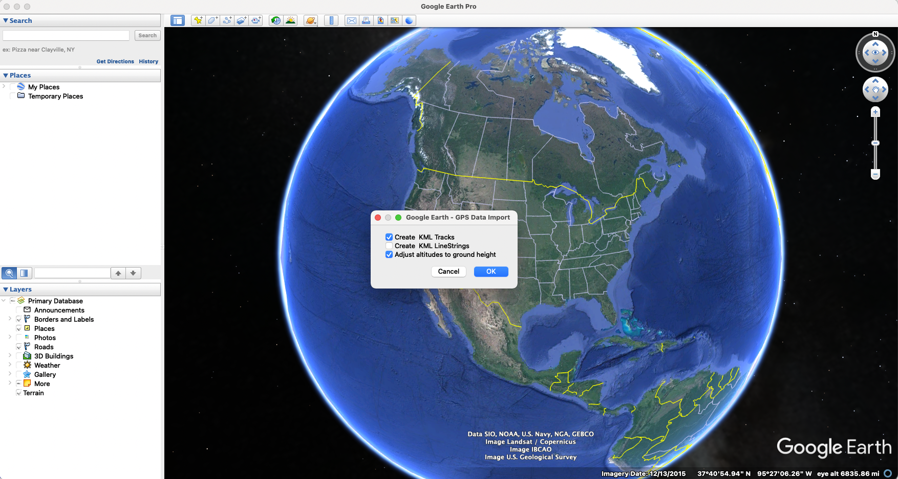
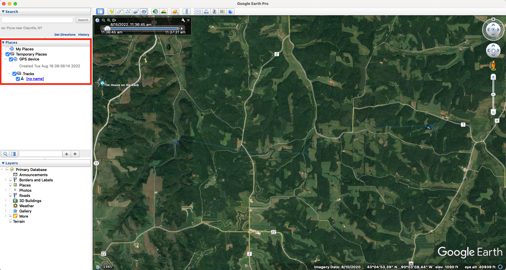

```{r setup, include=FALSE}
knitr::opts_chunk$set(echo = TRUE)
```

### Preamble

What this code does:

1. Code for prepping data for importation to Google Earth, especially for making videos of animal movement paths

2. Code for generating GIFs of animal movement from tracking data

```{r, results='hide', message=FALSE, warning=FALSE}
##### Clear Environment #####
remove(list=ls())


#### load libraries ####
library(sp)
library(rgdal)
library(rgeos)
library(adehabitatLT)
library(sf)
library(ggplot2)
library(raster)
library(move)
library(moveVis)
library(vembedr)
```
\

# **Make a video of animal movement**

We'll use Google Earth Pro to make a video of animal movement, but first we'll prep our data in R.

\

### Load and prep data
First, we'll load and view our data. This is dispersal data for a young male deer, and we will evaluate just the period of this animal's dispersal.

```{r load and plot data}
#### load data ####
pts <- read.csv("Tutorial_data/movement_video_tutorial_data.csv", header = T)
pts$date <- as.POSIXct(pts$date, tz = "America/Chicago")
head(pts)

# view plot of trajectory, with path colored by date of location
ggplot(pts, aes(x = x, y = y, color = date)) + geom_path() + theme_bw() + coord_fixed()

```

Next, we'll convert our movement data to the correct coordinate reference systems (CRS).

```{r convert data}
## convert to an sf object to facilitate reprojecting coordinates
mov <- pts %>%
  sf::st_as_sf(coords = c("x", "y"), crs = 6610)


## Reproject coordinates ##
mov.latlong <- st_transform(mov, crs = 4326) # convert to lat/long coordinates (for Google Earth example)
mov.nlcd <- st_transform(mov, crs = 3857) # convert to match NLCD coordinate reference system (for GIF example)


## Extract reprojected lat/long coordinates ##
coord <- data.frame(st_coordinates(mov.latlong))
colnames(coord) <- c("x", "y")
head(coord)
```

\
\

### Write out GPX file which we will load into Google Earth for tracing the "live" track
Now that we've prepped our data, we can write it out into the file format for use in Google Earth Pro.

We'll write a function for creating a GPX file.
```{r GPX function}
## function for writing out GPX files
writeGPX <- function(lat, lon, time, out_file) { 
  o <- c('<gpx version="1.1" creator="R">','<trk>','<trkseg>') 
  if (missing(time)) 
    o <- c(o, paste('<trkpt lat="',lat,'" lon="',lon,'" />', sep='')) 
  else 
    o <- c(o, paste('<trkpt lat="',lat,'" lon="',lon,'"><time>',paste(gsub(' ','T', as.character(time)), 'Z', sep=''),'</time></trkpt>', sep='')) 
  o <- c(o, '</trkseg>', '</trk>', '</gpx>') 
  if (is.character(out_file) || inherits(out_file, "connection")) 
    cat(o, file=out_file, sep='\n') }
```


Next, we'll use that function to write out our track file. We can also control the time scale of the animal movement that goes into this file. This data formatting can ultimately be used to make videos with data from a variety of sources - you just need lat/long coordinate data and time stamps.
```{r write out gpx, eval=FALSE}
## Google Earth will move along the track based on the time stamps in the imported file. Using the original time stamps makes the track go very 
# slowly, so we'll scale it to a faster rate. You could modify this line to aim for, for example, a constant movement rate along the track.
secs <- Sys.time() + c(0, cumsum(mov.latlong$dt[1:(nrow(coord)-1)]/10000)) # scale to movement rate
writeGPX(lat = coord$y, lon = coord$x, time = secs, out_file = "test_trk_zoomin.gpx")
```

\
\

### Now we'll open this file in Google Earth Pro
Open Google Earth Pro. To load data, click “File” --> “Open” and select the .gpx file we created in the last step. A pop-up box will appear; select “Create KML Tracks” and “Adjust altitudes to ground height” as shown below:



\
\

Your GPS data “track” should look like this once it’s loaded into Google Earth Pro:


\
\
\

### Change the visual style of the track

You can easily change the visual style of the track. To start, expand the “GPS device” data so you can see “Tracks” - see the area in the red square in the photo below.



\
\

Next, follow the steps in the video below: right click on “Tracks” and select “Get info.” A pop-up window will appear. Click the button for “Style, Color” and then you can update the appearance of the track.

```{r track style video, echo=FALSE}
embed_url("https://youtu.be/iCKNSaijI0M")
```

\
\

### Change the appearance of a "tour."

To make a video along the track, we’ll be making what Google Earth Pro calls a “tour.” Google Earth Pro has a variety of different settings to change the appearance of a tour, including the camera angle, viewing range, and speed. Follow along in the video below to see how to access and change tour preferences and how to watch a tour without recording it. 

```{r tour preferences video, echo=FALSE}
embed_url("https://youtu.be/PTBuBqqpOeE")
```

\
\

### Record a "tour"

Once you are satisfied with the track and tour settings, you can record a video of the tour. The video below shows how to use Google Earth Pro's "movie maker" function to make one of these videos. In brief, the steps are to:

1. Start playing the tour of the selected track: With the track selected, click the folder icon ("Play tour"). This pops up a control panel in the bottom left of the map.

2. Save the tour: Click the save button in the control panel from step 1 and give your tour an easy to remember name.

3. Close the control panel: In order to access the "movie maker" function, you need to "x" out of the control panel from step 1.

4. Record movie: Click "Tools" in the top menu and select "Movie Maker." If you cannot click "Movie Maker" make sure you've closed the control panel from step 1. Select the tour you want to make a video of, then choose your output name, location, and other movie settings and create your movie! The video creation itself will take a little while to complete.


```{r record tour video, echo=FALSE}
embed_url("https://youtu.be/KIDHZbV6-4M")
```

\
\

### Edit your movie

After you've made your movie using Google Earth Pro, you can fine-tune elements using standard video editing software. This could include making clips of subsets of the video, adjusting the speed in different sections, adding text or audio to the video - and more! While I won't include details of video editing here, some useful video editing software includes iMovie (Mac users) or Adobe Premiere Pro (Mac or Windows users).

\
\

# **Make a GIF of animal movement**

In addition to making movies of animal movement in Google Earth Pro, we can also make gifs of animal movement in R.


### Create a "move" object of the movement data
We want to use the movement data projected to the CRS that aligns with NLCD raster data (what we'll use as a basemap).

```{r gather NLCD movement data}
dat.nlcd.co <- st_coordinates(mov.nlcd)
dat.nlcd <- st_drop_geometry(mov.nlcd)
dat.nlcd <- cbind(dat.nlcd, dat.nlcd.co)
```

With this data, we'll create and align a "move" object.
```{r move object, message=FALSE, warning=FALSE}
# create the move object
deer_move <- move(dat.nlcd$X, dat.nlcd$Y, time = dat.nlcd$date, proj =  CRS("+init=epsg:3857"), animal = dat.nlcd$id)
# align movement data (uniform temporal resolution)
m <- align_move(deer_move, res = "mean", digit = "mean", unit = "hours", spaceMethod = "euclidean")
```

### Load landscape layers
Next, we'll load the landscape layers we want to use in our gif. In this case, we're using a land cover raster (NLCD) and a layer of rivers/streams.

```{r load landscape, message=F, warning=F}
# load landscape layers
load("Tutorial_data/movement_video_tutorial_layers.Rdata")
nlcd <- layers$nlcd # nlcd raster for the focal area
rivs <- layers$rivs # rivers/streams SpatialLinesDataFrame for the study area
rf <- fortify(rivs) # convert for plotting
```

### Create gif
We'll use the MoveVis package to create the spatial frames for our gif.

```{r create spatial frames}
### create spatial frames with a base raster map ###
frames <- frames_spatial(m, path_colours = c("red"),
                         # map_service = "osm", map_type = "terrain", alpha = 0.5, # can alternatively use in-package base maps (e.g., open street maps)
                         r_list = nlcd, crop_raster = T, r_times = Sys.time(), r_type = "discrete",
                         equidistant = F,
                         path_legend = F) %>% 
  add_gg(gg = expr(geom_path(data = rf, aes(x = long, y = lat, group = group), colour = "#476BA0")), data = rf) %>% # add rivers (though they'll plot on top of the track)
  # add other customizations
  add_gg(gg = expr(theme(legend.position = "none", axis.text.x = element_text(angle = 90)))) %>%
  add_gg(gg = expr(xlab("Easting (m)") )) %>%
  add_gg(gg = expr(ylab("Northing (m)") )) %>%
  add_northarrow() %>%
  add_scalebar(units = "km", colour = "black") %>%
  add_timestamps(m, type = "label") %>%
  # this controls the colors of the raster basemap
  add_colourscale(type = "discrete", 
                  colours = c("11" = "#476BA0",
                              "21" = "#D89382",
                              "22" = "#D89382",
                              "23" = "#D89382",
                              "24" = "#D89382",
                              "31" = "#B2ADA3",
                              "41" = "#68AA63",
                              "42" = "#68AA63",
                              "43" = "#68AA63",
                              "52" = "#CCBA7C",
                              "71" = "#B2ADA3",
                              "81" = "#fff7bc",
                              "82" = "#fff7bc",
                              "90" = "#B2ADA3",
                              "95" = "#B2ADA3"),
                  legend_title = "Land Cover") %>%
  add_progress()


frames[[15]] # preview one of the frames, e.g. the 100th frame
```

If we're satisfied with the product, we can write out our frames as a gif.

```{r save, eval=FALSE}
animate_frames(frames, out_file = "moveDeer_test_nlcd.gif") # this will take a couple of minutes
```

\
\
\

**Session Info**
```{r session info}
sessionInfo()
```